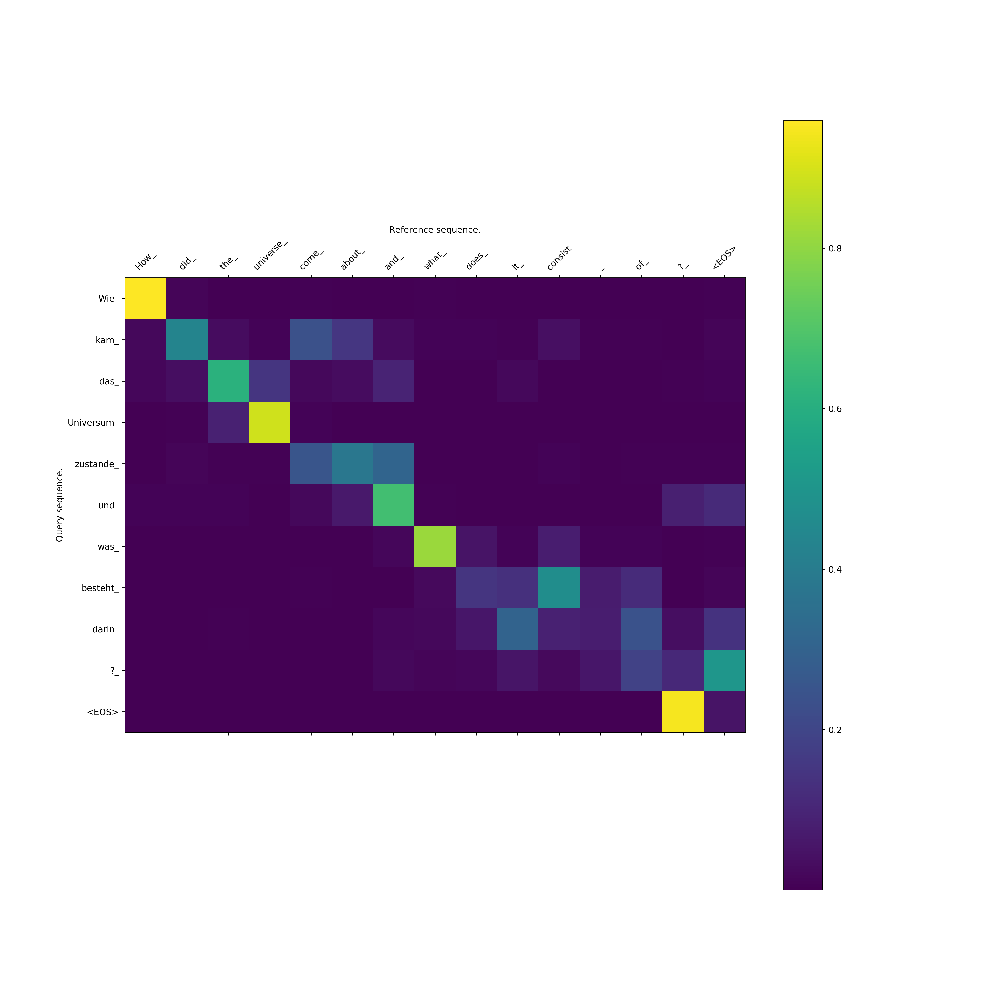

# TensorFlow seq2seq model

<p align="center">
  
</p>


This is a TensorFlow re-implementation of the seq2seq model using encoder-decoder architecture with attention mechanism. If you wish to gain some high-level understanding about how seq2seq model works, you can follow this [guide](https://github.com/chao-ji/tf-seq2seq/blob/master/g3doc/Build_seq2seq_model.md).


### Usage

This implementation relies on a [proto buffer](https://developers.google.com/protocol-buffers/) configuration file to manage all parameter settings. 

First you need to download & install [proto buffer compiler](https://developers.google.com/protocol-buffers/docs/downloads), and compile the `seq2seq.proto` file by running
```
  protoc --python_out=. protos/seq2seq.proto
``` 
which generates `seq2seq_pb2.py` in the `protos` directory.

##### Training
To perform training, run
```
python run_training.py \
    --src_file_list=/PATH/TO/SRC_FILE_LIST \
    --tgt_file_list=/PATH/TO/TGT_FILE_LIST \
    --src_vocab_file=/PATH/TO/SRC_VOCAB_FILE \
    --tgt_vocab_file=/PATH/TO/TGT_VOCAB_FILE \
    --config_file=/PATH/TO/CONFIG_FILE
```

`src_file_list` (or `tgt_file_list`) can be a single file name or a list of comma-separated file names, where each line of the file holds a single sequence (tokens separated by a space) of the source or target. `src_vocab_file` (or `tgt_vocab_file`) is a text file where each line holds a single vocabulary item. `config_file` is a configuration file with all parameter settings. A default one (`seq2seq.config`) is provided in `protos` directory, which can be modified as needed.

##### Evaluation and Inference

A seq2seq model can be evaluated both *internally* and *externally*. 

The *internal evaluation* runs the source input sequence and target input sequence through the forward pass, and computes a loss by comparing the prediction logits and groundtruth target output sequence. It reports *Perplexity*, which is a function of the cross entroy loss. 

To perform internal evaluation, run
```
  python run_internal_evaluation.py 
    --ckpt_path=/PATH/TO/CKPT
    --config_file=/PATH/TO/CONFIG_FILE
    --src_file=/PATH/TO/SRC_FILE
    --tgt_file=/PATH/TO/TGT_FILE
    --src_vocab_file=/PATH/TO/SRC_VOCAB_FILE
    --tgt_vocab_file=/PATH/TO/TGT_VOCAB_FILE
```
where `ckpt_path` points to a checkpoint file holding a trained model, and `src_file` (or `tgt_file`) is a single text file holding a source (or target) sequence on each line. 

For the *external evaluation*, a translated sequence is generated off an input sequence (`--src_file`) and compared against a groundtruth sequence (`--tgt_file`). It reports *BLEU* score, which is directly related to translation quality (e.g. in Neural Machine Translation). 

To perform external evaluation, run
```
  python run_inference.py 
    --ckpt_path=/PATH/TO/CKPT
    --config_file=/PATH/TO/CONFIG_FILE
    --src_file=/PATH/TO/SRC_FILE
    --tgt_file=/PATH/TO/TGT_FILE
    --src_vocab_file=/PATH/TO/SRC_VOCAB_FILE
    --tgt_vocab_file=/PATH/TO/TGT_VOCAB_FILE
```
To make inference without comparing against the groundtruth, simply leave out the `tgt_file` flag. The output file `output.txt` is located in the directory specified by the `--out_dir` flag. 

### Neural Machine Translation between English and Vietnamese
This is the example used in the [NMT tensorflow tutorial](https://github.com/tensorflow/nmt). To download the data, simple run the [sciprt](https://github.com/tensorflow/nmt/blob/master/nmt/scripts/download_iwslt15.sh).

The parameter settings are the same in the [tutorial](https://github.com/tensorflow/nmt#iwslt-english-vietnamese): 
* 2-layer LSTMs of 512 units with bidirectional encoder 
* Embedding size: 512
* Scaled Luong Attention
* Dropout: 0.2 (keep prob is 0.8)
* SGD optimizer with 1.0 initial learning rate. Train for 12K steps; after 8K steps, half the learning rate every 1K step.
* Beam width (beam width 10) is used for decoding.

Here are the metrics in terms of BLEU scores. You may get slightly different results due to weight initialization and other random factors. 

|Dataset|English to Vietnamese|Vietnamese to English|
|-|-|-|
|tst2012|24.0|22.3|
|tst2013|25.9|25.0|


The attention mechanism allows you to record the alignment scores between a translated sequence and its input sequence. For example, in the following aligment between the output and input, we can see that the pairs of words `I` and `Tôi`, `when` and `khi`, `after` and `sau` are highly related as they turns out to have the same meaning.

To visualize the alignment, you can run the `run_inference.py` executable as above, and `cd` to the output directory (`--out_dir`), and start tensorboard by running `tensorboard --logdir=.`.


<p align="center">
  
  Alignment between an input Vietnamese sentence and an output English translation. 
</p>


### Generic Sequence Transducer
It turns out that seq2seq is likely to be able to perform a general class of prediction tasks where the input and output are sequences of arbitrary length, not just translation.

Here is a fun experiment: you generate input sequences of different lengths (say 5 to 50) containing random integers from a range (say 0 to 128) and their sorted counterpart as the output sequences. You train your seq2seq model on that data, and you test the trained model on some new input sequences. 

Here is a sample of the new sequences and their outputs.

``` 
88 57 105 41 99 115 76 3 92 21 77 63 33 91 67 25 20 57 51 60 104 117 108 39 84
3 20 21 25 33 39 41 51 57 57 60 63 67 76 77 84 88 91 92 99 104 105 108 115 117

6 72 60 61 51 59 81 42
6 42 51 59 60 61 72 81

18 121 14 101 17 12 20 84 119 46 75 109 74 125 45 112 127 41 86 39 76 48 97 120 33 0
0 12 14 17 18 20 33 39 41 45 46 48 74 75 76 84 86 97 101 109 112 119 120 121 125 127

57 35 83 69 87 2 39 24 41 87 39 57 126 104 61 112 3 94 110 33 111 46 7 26 95 103 65 20 67 127 104 28 56 29 23 20 23 39 126 46 25 100
2 3 7 20 20 23 23 24 25 26 28 29 33 35 39 39 39 41 46 46 56 57 57 61 65 67 69 83 87 87 94 95 100 103 104 104 110 111 112 126 126 127

24 127 61 50 32 37 20 64 19 103 106 43 34 97 101 106 85 111 112 43 80 58 25 64 18 97 89 75 118 36 117 117 12 92 41 41 50 115 95
12 18 19 20 24 25 32 34 36 37 41 41 43 43 50 50 58 61 64 64 75 80 85 89 92 95 97 97 101 103 106 106 111 112 115 117 117 118 127
```

You just "invented" a sorting algorithm using a seq2seq model. 

The integers, just like the words in sentences, are represented internally as multidimensional vectors (distributed representation), so the seq2seq must be able to figure out that there is an inherent relationship among these symbols (integers in this case): some symbols are "greater" or "less" than others, and the task you intend to perform is sorting.

This may look like a trivial example, but at least it shows the seq2seq model's potential to be a generic sequence transducer. It learns the task from the data.

