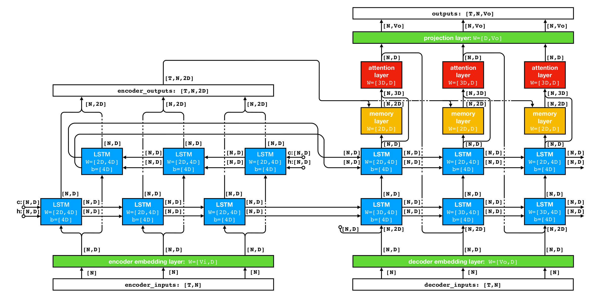

# TensorFlow seq2seq model

<p align="center">
  
</p>


A TensorFlow implementation of a seq2seq model using encoder-decoder architecture with attention mechanism.

### Usage


```
python run_training.py \
    --src_file_list=/PATH/TO/SRC_FILE_LIST \
    --tgt_file_list=/PATH/TO/TGT_FILE_LIST \
    --src_vocab_file=/PATH/TO/SRC_VOCAB_FILE \
    --tgt_vocab_file=/PATH/TO/TGT_VOCAB_FILE \
    --config_file=/PATH/TO/CONFIG_FILE
```

