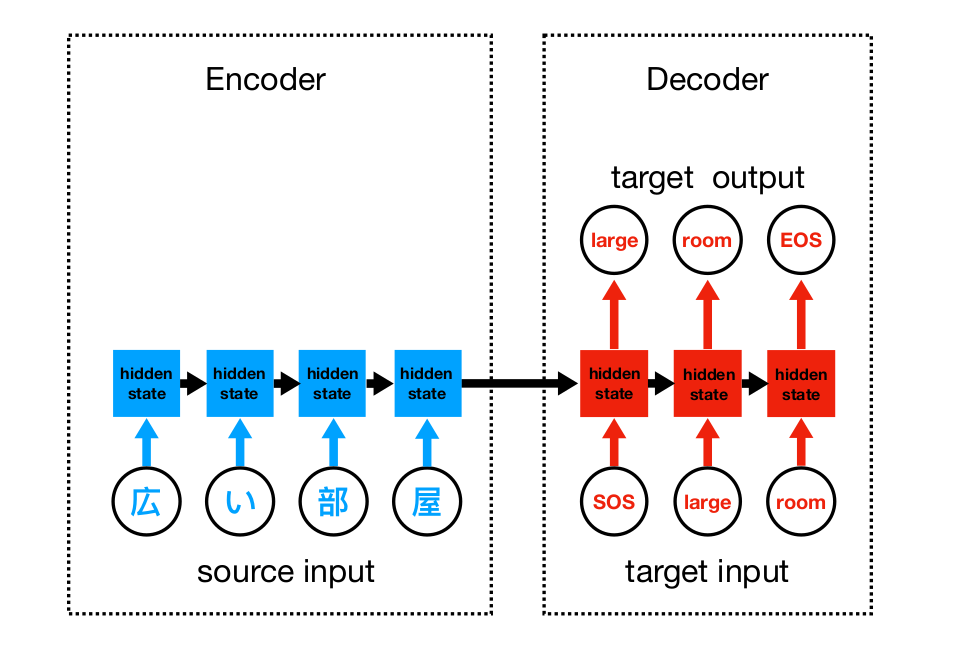
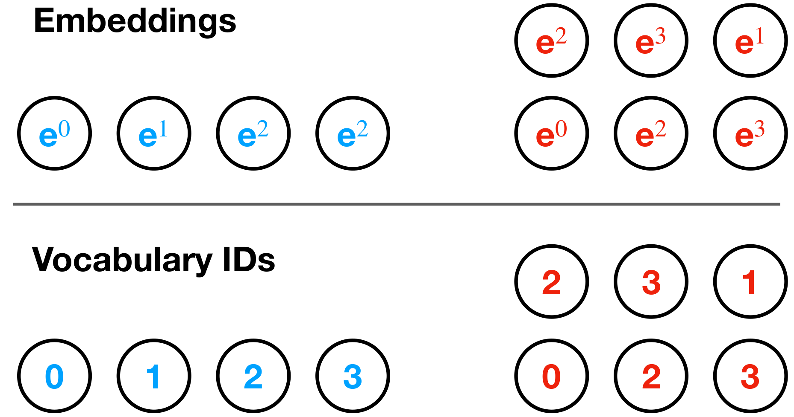
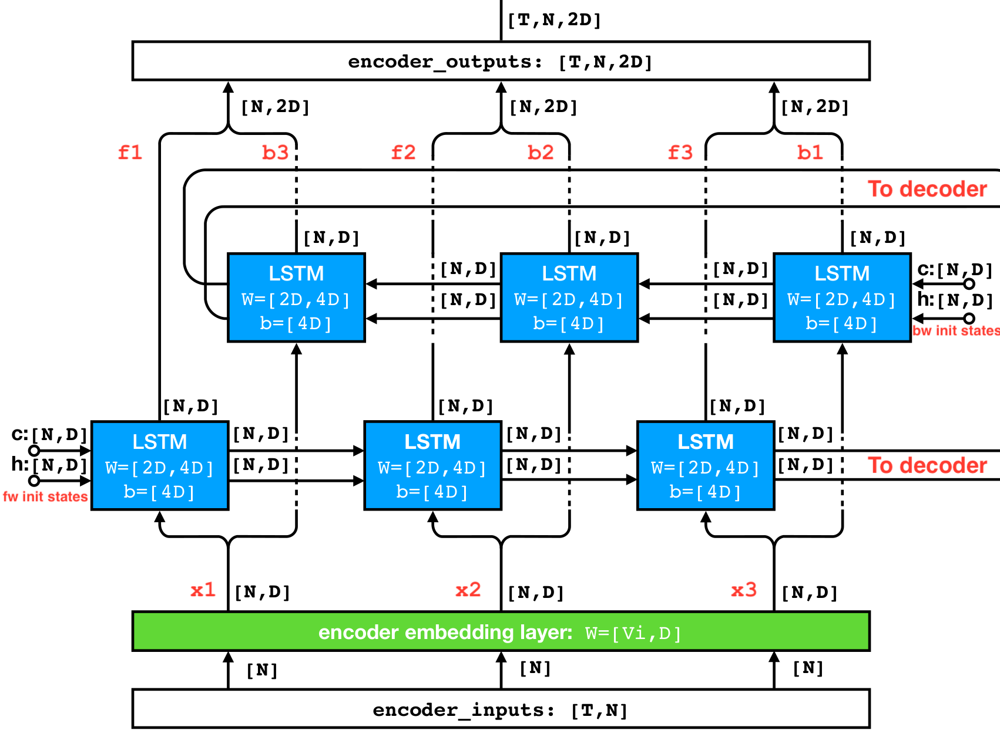
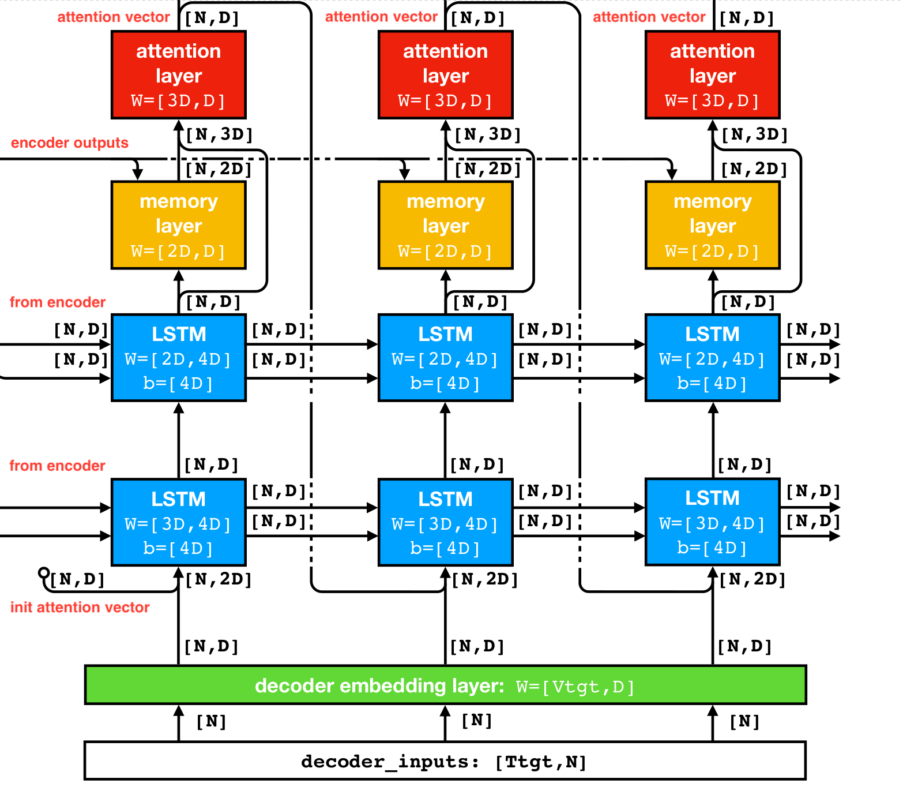
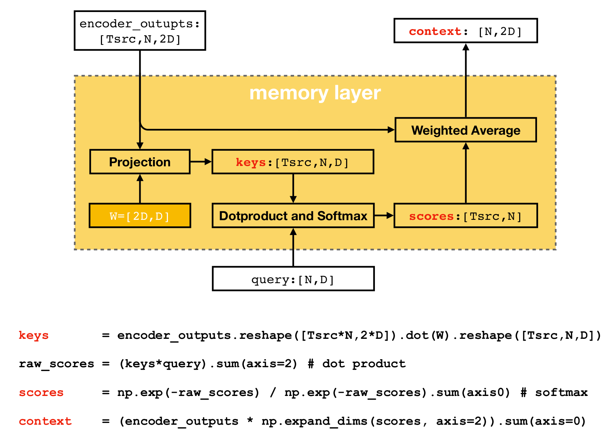
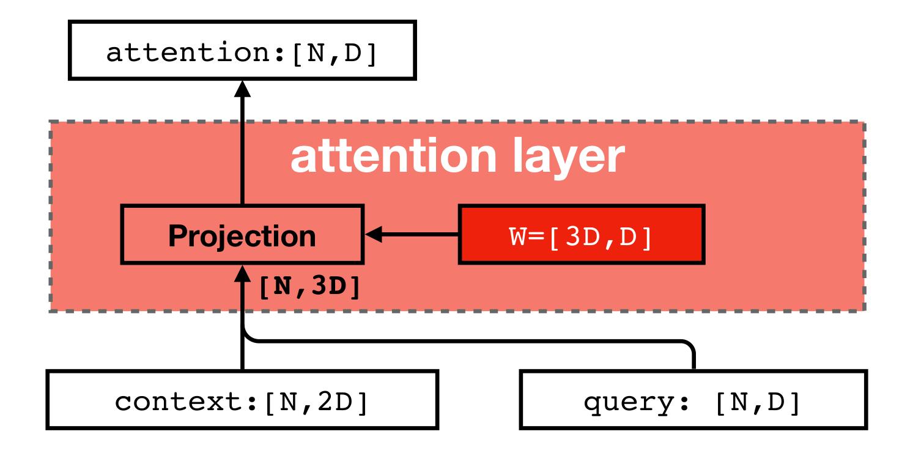

# Build a seq2seq Model
This guide overviews the key steps and concepts to build a seq2seq model implemented as an encoder-decoder architecture with attention mechanism. It does not intend to go into too much details, while still being informative enough to give you a clear picture of how the seq2seq model works under the hood. It is recommended that you have basic knowledge about how recurrent neural networks work (you can check this [post](https://karpathy.github.io/2015/05/21/rnn-effectiveness/) if you don't).

### Encoder-Decoder Architecture

At a high level, the seq2seq model is composed of an encoder RNN and a decoder RNN, where the encoder operates on a **source** sequence, and the decoder operates on a **target** sequence. 

For example, in the case of NMT the source sequence is a list of four tokens in Japenese "広", "い", "部", "屋", and the target sequence is a list of two tokens in English "large", "room". The end goal is to output the phrase "large room" given the input "広い部屋". To achieve this, the encoder RNN reads the source sequence tokens one at a time, and meanwhile updates its hidden layer (i.e. real-valued multi-dimensional vector) accordingly, before handing over to the decoder.

Like the encoder, the decoder updates its hidden layer upon reading each target sequence token. But unlike the encoder that just reads in the source sequence without generating any output, the decoder is supposed to generate a prediction sequence. Note that the final state of encoder's hidden layer has captured all the information the decoder needs about the source sequence, so it can be used to initialize the decoder's hidden layer. 

  
   
  Encoder-decoder architecture is trained on source input sequence, target input and target output Sequence.

The decoder is designed to generate prediction in two modes. At the time of training, a **target input** sequence is used to *cue* the decoder to emit predicted tokens one at a time, and a **target output** sequence as groundtruth. Specifically, we respectively prepend and append the target sequence "large room" with special marker `sos` (start of sequence) and `eos` (end of sequence) to obtain the target input and target output sequence. Upon reading `sos`, the decoder is given the signal that prediction has started, and is expected to emit the first token "large" in the target sequence, and on "large" emit the second token "room". When reading the last token "room", the decoder's hidden layer should be in a state that signals it has come to the end of the prediction, and is expected to emit `eos`. 

### Prepare the Data

  
   
  Convert raw tokens to real-valued embedding vectors.

As noted above, we need to prepare a target input and a target output sequence, together with the source sequence, to train an encoder-decoder architecture. In addition they need to be numerically represented to be directly processed by the RNNs .

The idea is to convert the raw tokens into IDs, which are just the token indices into the source or target vocabulary. For example, "広" has index 0 in Japanese vocabulary, and "room" has index 3 in English vocabulary. Note that the target vocabulary has been augmented with `sos` and `eos`. 

These integer IDs need to be further mapped to real-valued vectors. For a source vocabulary of size `Vs` and a target vocabulary of size `Vt`, we initialize a real-valued matrix of shape `[Vs, D]` and another of shape `[Vt, D]` where `D` is the desired size of embedding. The matrices can be used as lookup tables to retrieve the embedding vectors for each ID. For example, "広" is represented as the 0th row of the source matrix and "room" is represented as the 3rd row of the target matrix.   
In this way the source sequence ends up being represented as a list of 4 D-dimentional vectors and target input and output sequences as two lists of 3 D-dimensional vectors.

##### LSTM RNN Cell

### Build the Encoder
Here the encoder is implemented as a two-layer bi-directional RNN. It operates like a regular RNN except that it reads the source sequence in two directions. The forward RNN (bottom) reads input sequence from left to right, while the backward RNN (top) reads the same sequence in reverse direction.

Suppose we have a source sequence of length three, represented as three matrices `x1`, `x2`, `x3` of shape `[N, D]` (`N` is just the batch size). The sequence is presented to the forward RNN in the order of `x1`, `x2`, `x3`, and to the backward RNN in the order of `x3`, `x2`, `x1`. The forward RNN will generate a sequence of hidden states `f1`, `f2`, `f3` over time, and likewise `b3`, `b2`, `b1` for backward RNN. These hidden states are paired if they are resulted from the same input token: `[f1, b3]`,  `[f2, b2]`, `[f3, b1]`. The two hidden states are concatenated along the depth dimension, so finally we are left with 3 hidden state matrices of shape `[N, 2D]`. These matrices (`encoder_outputs`) form a *memory lookup table* to be utilized by the attention mechanism which will be covered later.

  
   
  Bidirectional Encoder Unfolded for a Sequence of Length Three.

### Build the Decoder

  
   
  Decoder with Attention Mechanism Unfolded for a Sequence of Length Three.

The decoder RNN is a two-layer RNN with LSTM cells. The first layer (bottom) takes as input an *augmented* version of the embedding vectors of target tokens: they are concatenated with **attention vectors** from the previous time step. The attention vectors are used to inform the decoder about the attention decisions made in previous step.

The second layer RNN (top) takes as input the hidden state from the first layer, and its own hidden state is fed to the **memory layer** and the **attention layer** to generate the **attention vector** for the next time step (how attention vectors are generated is covered in the next part).

### Attention Mechanism
Unlike the vanilla seq2seq model where the information about the entire source sequence (can be *arbitrarily long*) is squashed into a *fixed length* vector (i.e. encoder's final hidden state), the attention mechanism allows the decoder to access the encoder hidden states at each time step, so that the decoder can adaptively learn which source sequence token to pay attention to when generating the next target token.

##### Memory Layer

  
   
  Memory layer using Luong's multiplicative scoring function.

The attention mechanism is implemented by adding a **memory layer** and an **attention layer**. Generally, the memory layer compares a `query` vector (i.e. hidden state of the topmost decoder RNN) with the raw memory `encoder_outputs` to produce a `context` vector. 

The comparison relies on a scoring function to quantitatively measure the matching quality. Shown in the above figure is the *Luong*'s multiplicative scoring function (another being *Bahdanau*'s additive scoring function), where a transformed memory `keys` is computed by applying a projection to `encoding_outputs` and then a dot-product is computed between `query` and each time slice of `keys` (i.e. `keys[i, :]`). The outcome of dot-product then goes through a softmax function so we are left with `scores` -- the output of scoring function. The `scores` is used to compute `context` -- the weighted average of the raw memory `encoder_outputs` (over the time dimension).

##### Attention Layer

  
   
  Attention layer generates attention vector.

The attention layer generates an **attention vector** given the `context` from memory layer and the `query` from the hidden state of decoder RNN. It simply concatenates `context` and `query` along the depth dimension and projects it into `D`-dimensional space

### Project Layer

### Acknowledgement

